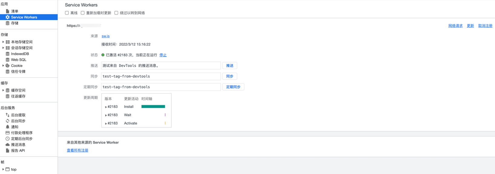
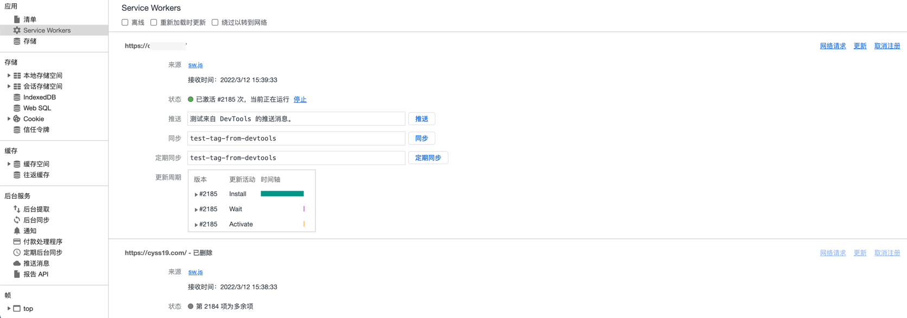

# Ant Design Pro Use Pwa

## describe

1. This project is initialized with [Ant Design Pro](https://pro.ant.design). Follow is the quick guide for how to use.
2. This project describe pwa.

## Use Pwa

1. `src` 下创建 `pwa` 文件夹，创建如下文件
    - `manifest.json` : pwa的配置文件
    - `register-service-worker.tsx` : 注册service-worker服务
    - `service-worker.js` : service-worker服务实体
 
2. 在 `conf/config.ts` 进行配置:
```base
const { InjectManifest } = require('workbox-webpack-plugin');

export default defineConfig({
  // 编译时将manifest.json拷贝到dist
  copy: [`/src/pwa/manifest.json`],
  // 在 index.html 的 header 中加载 manifest.json,开启pwa服务
  links: [{ rel: 'manifest', href: `/manifest.json` }],
  
  // 使用 workbox-webpack-plugin
  chainWebpack: (config: any) => {
    config.plugin('workbox').use(InjectManifest, [
      {
        swSrc: '/src/pwa/service-worker.js',
        swDest: 'sw.js',
        exclude: [/\.map$/, /favicon\.ico$/, /^manifest.*\.js?$/],
      },
    ]);
  }
}
```
3. 修改 `conf/defaultSettings.ts`
```base
// 开启pwa服务
pwa: true
```
        
4. `src/global.tsx` 下注册service-worker服务
```base
import './pwa/register-service-worker';
```

5. 编译配置https后，打开浏览器即可看到：

   
6. 随便修改一处地方，重新部署后，可以看到触发更新.

 
7. 点击刷新后，自动刷新页面，并重新注册服务



##### 感谢
- [umi/issues #4793](https://github.com/umijs/umi/issues/4793)
- [调研pwa和sw](https://www.cnblogs.com/yangzhou33/p/10595142.html)
- [Service Worker: 简介](https://developers.google.com/web/fundamentals/primers/service-workers#update-a-service-worker)
- [Web App Manifest.json](https://developer.mozilla.org/zh-CN/docs/Web/Manifest)

## Environment Prepare

Install `node_modules`:

```bash
npm install
```

or

```bash
yarn
```

## Provided Scripts

Ant Design Pro provides some useful script to help you quick start and build with web project, code style check and test.

Scripts provided in `package.json`. It's safe to modify or add additional script:

### Start project

```bash
npm start
```

### Build project

```bash
npm run build
```

### Check code style

```bash
npm run lint
```

You can also use script to auto fix some lint error:

```bash
npm run lint:fix
```

### Test code

```bash
npm test
```

## More

You can view full document on our [official website](https://pro.ant.design). And welcome any feedback in our [github](https://github.com/ant-design/ant-design-pro).
